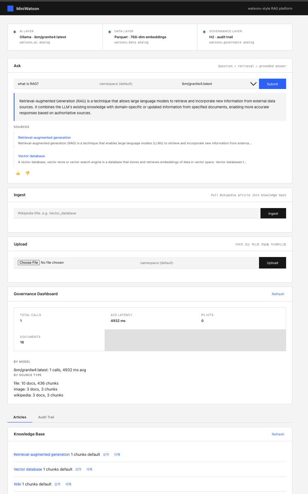

<!-- ============================================================= -->
<!-- watson-graph = MiniWatson 전체 + GraphRAG(증권·공시) 통합본 -->
<!-- ============================================================= -->

# watson-graph

**MiniWatson의 모든 기능 + 지식그래프(GraphRAG) 레이어**를 합친 프로젝트. 벡터(의미) + BM25(어휘)에 **지식그래프(관계)** 를 RRF로 융합해, 여러 문서에 흩어진 멀티홉 관계 질문(기업↔상품↔법령↔공시)까지 검색한다. 그래프 엔티티 추출은 로컬 친화(LLM 0회, 증권 도메인 사전+규칙).

**MiniWatson 대비 추가된 것**

- `data/KnowledgeGraph` — 도메인 엔티티 co-occurrence 그래프 + 멀티홉(BFS, 깊이 2) 탐색
- `service/DomainGlossary · DomainEntityExtractor · QueryRewriter` — 증권·자본시장(공시·IR) 사전, 엔티티 추출, 약어↔정식명 질의 재작성
- `HybridRetriever` — RRF에 그래프 후보 합류 (벡터+BM25+그래프)
- `RagService` — 질의 재작성 + 증권·공시 답변 페르소나
- 설정 토글: `retrieval.graph.enabled`, `persona.domain.enabled`
- 요청 EVAL 오버라이드: `/api/rag/ask` body의 `graph`(+기존 `hybrid`/`rerank`)
- `eval/` — **증권 멀티홉 평가셋**(`golden_multihop.json`, `corpus/`, `ingest_multihop.sh`, `run_multihop_eval.py`): vector-only → +bm25 → **+graph** A/B를 한 표로

**그래프 A/B 빠른 실행**

```bash
./mvnw spring-boot:run
bash eval/ingest_multihop.sh          # 증권 픽스처 코퍼스 적재 (ns=kr-securities)
python3 eval/run_multihop_eval.py     # +graph에서 multihop recall이 오르는지 확인
./mvnw -Dtest=KnowledgeGraphTest,DomainEntityExtractorTest test
```

설계·근거: `reference/graphrag/GRAPHRAG_PLAN.md`. 패키지는 `com.miniwatson` 유지(원본 구조 그대로).

아래는 원본 MiniWatson README.

---

# MiniWatson

[](https://github.com/dea980/miniwatson/actions/workflows/ci.yml)
[](https://gitlab.com/kdea989/miniwatson/-/pipelines)
[](#license)

> A miniature watsonx-style platform — built end-to-end from scratch  
> Spring Boot · Ollama · Parquet · 768-dim embeddings · RAG (chunking + reranking) · multimodal (vision + OCR) · tabular text-to-SQL (DuckDB) · multi-tenant · PII governance

> 정형 표(CSV/XLSX)는 DuckDB로 text-to-SQL — 집계는 SQL, 텍스트는 RAG.

MiniWatson is a learning project that recreates IBM watsonx's 3-layer architecture
(data · ai · governance) at a small scale. The goal: understand how enterprise
GenAI platforms work by building one — not by reading about it.



> 답변마다 출처(grounding)가 붙고, 모든 LLM 호출이 감사 로그에 남는다 — RAG와 거버넌스를 한 화면에서.

---

## Architecture

Three layers, each mapping to a watsonx component:

```
┌─────────────────────────────────────────────────────────┐
│  Frontend (Plain HTML + JS · IBM Carbon style)          │
│  http://localhost:8080                                  │
└─────────────────────────┬───────────────────────────────┘
│ REST · JSON
┌─────────────────────────▼───────────────────────────────┐
│  Backend: Spring Boot 4 · Java 21 (IBM Semeru)          │
│                                                         │
│  ┌────────────────────────────────────────────────────┐ │
│  │  AI Layer (watsonx.ai analog)                      │ │
│  │  • Chat: multi-LLM, per-request (gemma/granite/..) │ │
│  │  • Embeddings: 768-dim (granite-embedding:278m)    │ │
│  │  • Vision: image Q&A (llava / granite-vision)      │ │
│  │  • OCR grounding: Tesseract (exact text/numbers)   │ │
│  │  • RAG: chunk → embed → hybrid search → rerank     │ │
│  │  • Hybrid: vector + BM25 keyword (RRF fusion)      │ │
│  │  • Reranking: none/llm/mmr/cross (pluggable)       │ │
│  │  • Tabular: CSV/XLSX → text-to-SQL (DuckDB)        │ │
│  └────────────────────────────────────────────────────┘ │
│                                                         │
│  ┌────────────────────────────────────────────────────┐ │
│  │  Data Layer (watsonx.data analog)                  │ │
│  │  • Ingest: Wikipedia / image (vision+OCR) / file   │ │
│  │  • Multi-format: PDF/DOCX/PPTX/XLSX/HTML + HWP/HWPX│ │
│  │  • Chunking: fixed / recursive / semantic          │ │
│  │  • Multi-tenant namespaces + dedup + CRUD          │ │
│  │  • Tiered: hot JSON → cold Parquet (compaction)    │ │
│  │  • Catalog: H2 doc metadata (catalog/data split)   │ │
│  │  • Parquet (Avro schema, SNAPPY) — 7× < JSON       │ │
│  └────────────────────────────────────────────────────┘ │
│                                                         │
│  ┌────────────────────────────────────────────────────┐ │
│  │  Governance Layer (watsonx.governance analog)      │ │
│  │  • Auto audit log every LLM call in H2             │ │
│  │  • Tracks model, latency, timestamp                │ │
│  │  • PII detection & redaction before persist        │ │
│  │  • Provenance: source chunks logged per answer     │ │
│  └────────────────────────────────────────────────────┘ │
└─────────────────────────────────────────────────────────┘
```

---

## Tech Stack

| Layer | Choice | Why |
|---|---|---|
| Language | Java 21 (IBM Semeru) | Lower memory footprint than HotSpot |
| Framework | Spring Boot 4.0 | Enterprise standard, fast bootstrap |
| LLM | Ollama (local) | Sovereign deployment, no API keys |
| Chat model | ibm/granite4:latest (default) · multi-LLM | per-request model, whitelist-validated |
| Embedding model | granite-embedding:278m (default) · nomic / 30m / mxbai compared | 768-dim 다국어 승자 (recall 97%, 한국어 11/11). 4종 비교는 EMBEDDINGS.md |
| Vision model | llava / granite-vision | image Q&A + caption (multimodal) |
| OCR | Tesseract (CLI) | exact text/number extraction for grounding |
| Data format | Apache Parquet | Columnar + SNAPPY = 7× smaller than JSON |
| Schema | Avro | Schema-first, evolution-safe |
| Storage | Tiered (JSON hot → Parquet cold) | cheap appends + columnar compaction |
| Catalog | H2 document_catalog (mirror) | SQL-queryable KB metadata; catalog/data split |
| Retrieval | In-memory vector index (brute-force default, LSH opt-in) | exact cosine by default; LSH for sub-linear approximate kNN |
| Vector store | In-memory ↔ pgvector (`vector.store` 스위치) | 영속·확장은 pgvector(HNSW), 차원실험은 인메모리. 인메모리 패리티 35/35. PGVECTOR.md |
| Hybrid search | Vector + BM25 keyword, RRF fusion | lexical recall for exact tokens (IDs, codes) |
| Chunking | fixed / recursive / semantic (pluggable) | recursive default; balance quality vs cost |
| Reranking | none / llm / mmr / cross (pluggable) | two-stage: fetch top-N → rerank → top-K |
| Cross-encoder | DJL + PyTorch + BGE-reranker | dedicated reranker model (Linux/Apple Silicon) |
| Tabular SQL | DuckDB (embedded, in-memory) | text-to-SQL over CSV/XLSX; aggregation RAG can't do |
| Database | H2 (in-memory) | Zero config for governance audit |
| Security | API key / JWT 인증 + 테넌트 격리 강제 | namespace를 코드로 강제(authN/authZ 분리, A/B/C 3안). SECURITY.md |
| CI/CD | GitHub Actions + GitLab CI + Docker | 양쪽 `./mvnw test` 게이트(이식성). 이미지 빌드·푸시(GHCR)는 GitHub만, GitLab은 테스트 게이트 |
| Build | Maven | pom.xml + spring-boot-maven-plugin |
| Frontend | Plain HTML + JS | No framework lock-in, instant load |

---

## Docs

| 문서 | 내용 |
|---|---|
| [ARCHITECTURE.md](docs/ARCHITECTURE.md) | 컴포넌트·데이터 흐름 |
| [SECURITY.md](docs/SECURITY.md) | 위협모델 · 인증 A/B/C · 테넌트 격리 · 설계결정 |
| [RAG-LANDSCAPE.md](docs/RAG-LANDSCAPE.md) | RAG 종류(Naive/Advanced/Modular, RAPTOR/CRAG/GraphRAG 등) · 로컬 구현 가능성 · MiniWatson 현황 · 로드맵 |
| [PGVECTOR.md](docs/PGVECTOR.md) | pgvector 이관 · HNSW · 인메모리 패리티 |
| [EMBEDDINGS.md](docs/EMBEDDINGS.md) | 임베딩 4종 비교 (승자 granite-278m) |
| [CHUNKING.md](docs/CHUNKING.md) | 청킹 전략 + 약어 확장 |
| [EVALUATION.md](docs/EVALUATION.md) | 골든셋 recall + text-to-SQL |
| [DEBUGGING.md](docs/DEBUGGING.md) | 실전 트러블슈팅 |
| [DECISIONS.md](docs/DECISIONS.md) | 기술 선택 결정 가이드 |
| [OPERATIONS.md](docs/OPERATIONS.md) | 배포 · 재임베딩 · 가용성 · 장애 런북 · 프로덕션 체크리스트 |

---

## Quick Start

### Prerequisites

```bash
# 1. Java 21 (IBM Semeru recommended)
java --version    # → openjdk 21+

# 2. Ollama
brew install ollama
ollama pull ibm/granite4:latest  # chat (default)
ollama pull granite-embedding:278m   # 768-dim embeddings (default, 다국어)
ollama pull llava              # vision (multimodal Q&A / image ingest)

# 3. OCR (for image grounding — exact text/numbers)
brew install tesseract

# 4. Start Ollama server (separate terminal)
ollama serve
```

### Run

```bash
# Clone
git clone https://github.com/dea980/miniwatson.git
cd miniwatson

# Run Spring Boot
./mvnw spring-boot:run

# Open browser
open http://localhost:8080
```

### Try it

1. **Ingest** a Wikipedia article  
   → Type `Retrieval-augmented_generation`, click Ingest
2. **Ask** a question  
   → Type `What is RAG?`, click Submit
3. **Audit Trail** tab  
   → See every Q&A logged with model, latency, timestamp

---

## API

### Ingest Wikipedia article

```bash
curl -X POST "http://localhost:8080/api/data/ingest?title=Vector_database"
```

Returns the stored article (with `id`, `title`, `summary`, `url`, `ingestedAt`).
Embedding is generated and stored in Parquet but hidden from the response.

Optional `&namespace=acme` scopes the article to a tenant (default: `default`).

### Ask a RAG question

```bash
curl -X POST http://localhost:8080/api/rag/ask \
  -H "Content-Type: application/json" \
  -d '{"question": "What is RAG?", "namespace": "default", "model": "ibm/granite4:latest"}'
```

`namespace` and `model` are optional. Returns the answer plus the top-K source
articles used for grounding.

### Multi-LLM — list selectable chat models

```bash
curl http://localhost:8080/api/rag/models      # { default, available[] }
```

### Multimodal — image Q&A and image ingest

```bash
# Ask about an image (vision + OCR grounding)
curl -X POST http://localhost:8080/api/multimodal/ask \
  -F "image=@invoice.png" -F "question=What is the total?"

# Ingest an image into the knowledge base (searchable by later text queries)
curl -X POST http://localhost:8080/api/multimodal/ingest \
  -F "image=@invoice.png" -F "namespace=demo"
```

### Upload a text/document file (Tika + Korean HWP/HWPX)

```bash
curl -X POST http://localhost:8080/api/data/ingest-file \
  -F "file=@report.pdf" -F "namespace=demo"
```

The file is text-extracted, split into chunks, and each chunk stored as an
Article (`title #1`, `#2`, ...). Extraction branches by extension: Tika
(PDF/DOCX/PPTX/XLSX/HTML/txt/md/csv) and HWP/HWPX via hwplib/hwpxlib (see
[docs/INGESTION-FORMATS.md](docs/INGESTION-FORMATS.md)). Returns the list of
created chunks. Chunk strategy/size via `chunking.*` config.

### Summarize an uploaded document

```bash
curl -X POST http://localhost:8080/api/data/summarize/5   # any chunk id of the doc
```

Aggregates all chunks of the document (by base title) and returns a summary.
This is separate from RAG `ask` — summarization needs the whole document, not
retrieved fragments.

### List / delete articles, index stats

```bash
curl  http://localhost:8080/api/data/articles            # all (or ?namespace=demo)
curl -X DELETE http://localhost:8080/api/data/articles/5 # remove by id (+index resync)
curl  http://localhost:8080/api/data/index/stats         # mode (brute-force default), vectors, buckets
```

### Documents (document-level view over chunks)

```bash
# List documents (chunks grouped by namespace + title)
curl "http://localhost:8080/api/data/documents"

# Delete a whole document (all its chunks at once)
curl -X DELETE "http://localhost:8080/api/data/documents?title=report.pdf&namespace=demo"
```

A long file is stored as many chunks; these endpoints present and manage it as one
document. The same metadata is mirrored to the H2 `document_catalog` for SQL queries.

### Audit trail & governance stats

```bash
curl http://localhost:8080/api/governance/logs    # every LLM call (model, latency, PII, sources)
curl http://localhost:8080/api/governance/stats   # aggregates: per-model, per-source-type, KPI totals
```

Every LLM call is logged: question, answer, model, latency (ms), timestamp, and
**PII count** (sensitive data is masked before persisting).


---

## Configuration

All settings are externalized via Spring profiles and environment variables.

```yaml
# application.yaml
spring:
profiles:
active: dev      # dev | demo | prod

ollama:
url: ${OLLAMA_URL:http://localhost:11434}
chat-model: ${OLLAMA_CHAT_MODEL:ibm/granite4:latest}
chat-models: ${OLLAMA_CHAT_MODELS:ibm/granite4:latest,gemma4}  # multi-LLM whitelist
embed-model: ${OLLAMA_EMBED_MODEL:granite-embedding:278m}  # 비교 승자 (EMBEDDINGS.md 7절)
vision-model: ${OLLAMA_VISION_MODEL:llava:latest}                       # multimodal
num-predict: ${OLLAMA_NUM_PREDICT:256}

retrieval:
hybrid:
enabled: true          # vector + BM25 (false = vector-only)

storage:
tier:
threshold: ${STORAGE_TIER_THRESHOLD:3}     # hot(JSON) count before compaction → Parquet

vector:
index:
lsh:
enabled: ${VECTOR_LSH_ENABLED:false}       # brute-force default; true = LSH approximate kNN
hyperplanes: ${VECTOR_LSH_HYPERPLANES:16}

chunking:
strategy: recursive   # fixed | recursive | semantic
max-size: 1000        # chars per chunk

rerank:
strategy: mmr         # none | llm | mmr | cross

eval:
overrides:
enabled: ${EVAL_OVERRIDES:true}    # dev/demo = true, prod = false
```

### Profile overrides

| Profile | Storage | When |
|---|---|---|
| `dev` (default) | H2 in-memory | Fast iteration |
| `demo` | H2 file-backed | Persistent demos |
| `prod` | Externalized via env vars | Real deployment |

Switch model without code change:

```bash
OLLAMA_CHAT_MODEL=gemma4 ./mvnw spring-boot:run
```

---

## Project Structure

```
miniwatson/
├── src/main/java/com/miniwatson/
│   ├── MiniwatsonApplication.java
│   ├── controller/
│   │   ├── RagController.java            # POST /api/rag/ask · GET /api/rag/models
│   │   ├── DataController.java           # /api/data/* (ingest, file, delete, stats)
│   │   ├── MultimodalController.java     # /api/multimodal/ask · /ingest (vision)
│   │   ├── GovernanceController.java     # /api/governance/logs · /stats · POST /feedback
│   │   └── TabularController.java        # POST /api/tabular/load · /ask (DuckDB text-to-SQL)
│   ├── service/
│   │   ├── OllamaService.java            # Chat (multi-LLM) + vision (images)
│   │   ├── EmbeddingService.java         # Embed: 768-dim
│   │   ├── OcrService.java               # Tesseract CLI → text
│   │   ├── IngestionService.java         # Wikipedia / image / file → chunk → Article
│   │   ├── IndexingService.java          # one place to update all indexes (vector + keyword)
│   │   ├── HybridRetriever.java          # vector + BM25 candidates, RRF fusion
│   │   ├── Chunker.java                  # interface: fixed / recursive / semantic
│   │   ├── FixedChunker.java             # N-char + overlap (baseline)
│   │   ├── RecursiveChunker.java         # separator-priority split (default)
│   │   ├── SemanticChunker.java          # sentence-embedding boundary detection
│   │   ├── Reranker.java                 # interface: none / llm / mmr / cross
│   │   ├── NoopReranker.java             # 1st-stage top-K passthrough (baseline)
│   │   ├── LlmReranker.java              # listwise LLM rerank
│   │   ├── MmrReranker.java              # relevance + diversity (MMR)
│   │   ├── CrossEncoderReranker.java     # DJL cross-encoder (graceful fallback)
│   │   └── RagService.java               # Embed → vector search (top-N) → rerank → top-K
│   ├── data/
│   │   ├── Article.java                  # POJO + namespace + embedding (write-only)
│   │   ├── WikipediaResponse.java        # External API DTO
│   │   ├── ArticleRepository.java        # storage interface
│   │   ├── ArticleStore.java             # JSON store (hot tier)
│   │   ├── ArticleParquetStore.java      # Parquet store (cold tier)
│   │   ├── TieredArticleStore.java       # hot→cold compaction (@Primary)
│   │   ├── VectorIndex.java              # in-memory LSH index (semantic)
│   │   └── KeywordIndex.java             # in-memory BM25 index (lexical)
│   ├── governance/
│   │   ├── QueryLog.java                 # JPA entity (+ piiCount, sources/provenance)
│   │   ├── QueryLogRepository.java       # Spring Data JPA
│   │   ├── DocumentCatalog.java          # KB metadata mirror (H2, catalog/data split)
│   │   ├── DocumentCatalogRepository.java
│   │   └── PiiRedactionService.java      # regex PII masking
│   └── dto/
│       ├── AskRequest.java
│       ├── OllamaRequest.java            # Includes think:false
│       ├── OllamaResponse.java
│       ├── EmbeddingRequest.java
│       └── EmbeddingResponse.java
├── src/main/resources/
│   ├── application.yaml                  # Common config + active profile
│   ├── application-dev.yaml              # H2 in-memory
│   ├── application-demo.yaml             # H2 file-backed
│   ├── application-prod.yaml             # Env vars (PostgreSQL ready)
│   ├── article.avsc                      # Avro schema for Parquet
│   └── static/
│       ├── index.html                    # Dashboard
│       ├── css/styles.css                # IBM Carbon-inspired
│       └── js/app.js                     # fetch + DOM
├── data/                                 # runtime state (gitignored)
│   ├── articles.json                     # hot tier (recent appends)
│   └── articles.parquet                  # cold tier (compacted)
├── docs/                                 # API, ARCHITECTURE, GOVERNANCE, MULTIMODAL, ...
├── sample/                               # demo fixtures (invoice, chart, text)
└── pom.xml
```

---

## Storage Efficiency

Migrating embedding storage from JSON to Parquet:

| Format | Size | Compression |
|---|---|---|
| JSON (with 768-dim float arrays) | 54 KB | baseline |
| **Parquet (SNAPPY)** | **7.8 KB** | **7×** |

Parquet's columnar layout means embedding columns compress aggressively
while still allowing per-row reads. This is exactly why watsonx.data uses
Parquet as its native format.

---

## What I Learned

Notes from building this:

- **Java 21 + Hadoop SecurityManager** — Hadoop's `UserGroupInformation`
  calls `Subject.getSubject()` which Java 17+ deprecated. Fix:
  `-Djava.security.manager=allow` in JVM arguments.

- **Gemma "thinking" tokens** — gemma3/gemma4 uses internal reasoning
  tokens that drain the `num_predict` budget. `think: false` disables
  this; cut latency by ~3×.

- **Wikipedia User-Agent policy** — REST API requires
  `User-Agent: AppName/version (URL; email)` or returns 403. Standard
  enterprise API hygiene.

- **Anti-corruption layer** — Keeping `WikipediaResponse` separate from
  internal `Article` lets the external API change without touching the
  rest of the codebase.

- **`@JsonProperty(WRITE_ONLY)`** — Hide 768-dim embedding from the API
  response while keeping it in storage. Trims 50KB+ off every response.

- **Spring profiles for sovereignty** — dev/demo/prod with environment
  variables means the same code ships to different environments with
  different credentials. This is the technical implementation of
  "sovereignty at the core."

- **Vision models hallucinate numbers; OCR doesn't** — `llava` invented an
  invoice total that wasn't on the page. The fix wasn't a bigger model — it was
  splitting roles: OCR (Tesseract) for exact text, vision for layout/context,
  and a prompt that tells the LLM to *trust OCR over vision* on conflicts.
  Combining sources isn't enough; you must declare which one is authoritative.
  (See `docs/MULTIMODAL.md` for the full before/after and limitations.)

- **OCR has its own failure modes** — it nails row-structured tables but
  mangles low-contrast/inverted text and loses the 2-D mapping in charts
  (reads `$28M` but not that it belongs to Q4). The hard part is the pipeline,
  not the model.

- **LSH for sub-linear retrieval** — random-hyperplane signatures bucket
  similar vectors so a query only scores a small candidate set, with an
  exact-cosine fallback for correctness. Dimension-agnostic (384/768/1024).

- **Chunking is the real fix for long-doc retrieval** — a 90k-char PDF stored
  as one embedding broke retrieval: the embedder truncates past ~8k tokens, and
  one vector can't match a specific passage. Splitting into per-chunk Articles
  fixed it (101 chunks). Compared fixed/recursive/semantic — recursive wins on
  quality-vs-cost; semantic is best but pays a per-sentence embedding cost.
  (See `docs/CHUNKING.md`.)

- **Reranking helps most when first-stage search is weak** — fetch top-N (20)
  then rerank to top-K (2). On a strong embedder + good chunks, easy questions
  already rank right and rerank barely changes them; the gain shows on
  vocabulary-mismatch questions. Built none/llm/mmr/cross to compare.
  (See `docs/RERANKING.md`.)

- **Hybrid search fixes vector's blind spot for exact tokens** — embeddings can't
  match "INV-2026-0042" or a model name; BM25 (lexical) can. Fused vector + BM25
  with RRF (rank-based, no score normalization). Same caveat as rerank: on a small
  clean corpus the win is small (top-N already covers everything); it pays off on
  large/noisy corpora with rare-token queries. Indexing was split into one
  `IndexingService` so adding the keyword index touched only that one class.
  (See `docs/HYBRID-SEARCH.md`.)

- **Pin the error to the real cause, then design a fallback** — the DJL
  cross-encoder failed to load on Intel macOS. Suspected the OpenJ9 (Semeru)
  JVM first, but switching to HotSpot reproduced it — the real cause was a
  missing osx-x86_64 native (PyTorch dropped Intel-mac wheels). The reranker
  falls back to top-K instead of crashing (graceful degradation); it runs on
  Linux/Apple Silicon. Library APIs also differ by version — confirmed the
  0.30.0 javadoc instead of trusting an example (no `CrossEncoderTranslatorFactory`;
  input is `StringPair`).

- **Tiered storage = lakehouse in miniature** — cheap row-oriented appends
  (JSON hot tier) compacted into columnar Parquet (cold tier) past a threshold.
  Avoids rewriting the whole Parquet file on every single ingest.

- **Governance must redact PII** — the audit log is the leak risk. Mask
  emails/phones/SSNs/cards *before persisting*, return the original to the user.
  Function preserved, record protected.

- **Provenance makes answers auditable** — logging the rerank-final source chunks
  per answer means you can later check "was this grounded, and in what?" — and tell
  a retrieval error (wrong chunk) apart from a generation error (right chunk, wrong
  answer). One subtle bug: set the field *before* `save()`, or it never persists.

- **Catalog/data split = lakehouse in miniature** — vectors and text live in
  Parquet (the data); lightweight document metadata is mirrored to H2 (the catalog),
  so the knowledge base itself becomes SQL-queryable for governance. Parquet is the
  source of truth; the H2 catalog is rebuilt from it on startup (`@PostConstruct`),
  same philosophy as the vector index hydrate.

- **Spring Boot 4 ignores `javax.annotation`** — `@PostConstruct` silently never
  ran because it was imported from `javax`, not `jakarta`. On Jakarta EE, callbacks
  must use `jakarta.annotation`. When a lifecycle hook quietly doesn't fire, suspect
  the javax/jakarta namespace first.

---

## Roadmap

- [x] 1 — Spring Boot setup
- [x] 2 — Ollama integration (watsonx.ai analog)
- [x] 3 — H2 audit log (watsonx.governance analog)
- [x] 4 — Wikipedia → Parquet (watsonx.data analog)
- [x] 5 — RAG with embeddings + cosine similarity
- [x] 6 — Frontend dashboard (IBM Carbon-style)
- [x] 7 — Multi-tenant article namespacing
- [x] 8 — Vector index (random-hyperplane LSH) for sub-linear retrieval
- [x] 9 — Multi-LLM chat model selection (per-request, whitelist)
- [x] 10 — Multimodal vision Q&A + image ingest (Ollama vision)
- [x] 11 — OCR grounding (Tesseract) + OCR/Vision fusion
- [x] 12 — PII detection & redaction in audit log (governance)
- [x] 13 — Tiered storage (hot JSON → cold Parquet compaction)
- [x] 14 — Knowledge-base CRUD (delete, dedup, file upload)
- [x] 15 — Universal file ingest (Apache Tika) + document chunking (fixed/recursive/semantic)
- [x] 16 — Two-stage retrieval with pluggable reranking (none/llm/mmr/cross)
- [x] 17 — Provenance: source chunks logged per answer (governance)
- [x] 18 — Document catalog in H2 (catalog/data split, SQL-queryable KB)
- [x] 19 — Governance stats dashboard (per-model, per-source-type, KPIs)
- [x] 20 — Hybrid search (vector + BM25, RRF) with indexing split
- [x] 21 — Eval harness (recall + LLM-as-judge), unit tests, user feedback loop
- [x] 22 — PostgreSQL + pgvector container via Podman (prod profile, persistent governance storage)
- [x] 23 — Korean HWP/HWPX ingest (hwplib/hwpxlib + PrvText fallback); extractText extension dispatch
- [x] 24 — Embedding model comparison (384/768/1024-dim, 4종; 승자 granite-embedding:278m, recall 97% / 한국어 11/11)
- [x] 25 — PgVectorStore — pgvector(HNSW) 영속 vector store, 인메모리 패리티 35/35 (RRF id 붕괴 버그 해결)
- [x] 26 — 청킹 개선: 약어 확장(CAIO→Chief AI Officer)으로 구조적 miss 회복 → 35/35
- [x] 27 — 멀티테넌트 보안: API key/JWT 인증(A/B/C 3안) + 테넌트 격리 강제 (authN/authZ 분리)
- [x] 28 — CI/CD: GitHub Actions + GitLab CI 양쪽 테스트 게이트(./mvnw test, 이식성). 이미지 빌드·푸시(멀티아치 GHCR)는 GitHub Actions
- [x] 29 — 운영 하드닝: 감사 fail-open · Ollama 타임아웃 · rerank fallback · OPERATIONS.md
### 추후 (Backlog — 보류)

핵심 플랫폼(data/ai/governance) + 보안 + CI는 완성. 아래는 운영·심화 영역으로, 배포 산출물(docker-compose.prod, 멀티아치 CI, Oracle 가이드)은 준비됐으나 라이브 비용/시간 대비 우선순위를 미뤘다.

- [ ] 30 — 라이브 배포 (VPS docker-compose, 또는 IBM Cloud Code Engine + watsonx.ai 스왑)
- [ ] 31 — 보안 Tier 2: 프롬프트 인젝션 방어, PII 커버리지 확대, TLS/레이트리밋
- [ ] 32 — 평가 심화(RAGAS류 답변품질), 관측성(metrics/health/tracing)

---

## Why This Project

Reading about watsonx is one thing. Recreating its data-ai-governance
loop end-to-end is another. The point was to find out where the hard
parts actually are.

**Verdict:** they aren't in the model. They're in the pipeline,
the storage format, and the audit trail. That matches IBV CEO Study's
"6 capabilities for 5.4× adoption" — change management, AI governance,
data governance, real-time integration, system integration, financial
integration. Model selection is the easy part.

---

## License

MIT

---

## Documentation

| Doc | What's inside |
|---|---|
| [docs/API.md](docs/API.md) | REST API reference — every endpoint with curl + schemas |
| [docs/ARCHITECTURE.md](docs/ARCHITECTURE.md) | Component diagram, request flows, watsonx mapping |
| [docs/DATA-MODEL.md](docs/DATA-MODEL.md) | Article schema, Avro + Parquet, anti-corruption layer |
| [docs/GOVERNANCE.md](docs/GOVERNANCE.md) | Audit log schema + PII redaction, watsonx.governance parity |
| [docs/MULTIMODAL.md](docs/MULTIMODAL.md) | Vision Q&A + OCR grounding, image ingest, findings & limits |
| [docs/CHUNKING.md](docs/CHUNKING.md) | Chunking strategies (fixed/recursive/semantic), measured comparison |
| [docs/CHUNKING-TEST.md](docs/CHUNKING-TEST.md) | Step-by-step guide to reproduce the chunking comparison |
| [docs/RERANKING.md](docs/RERANKING.md) | Two-stage retrieval, reranker strategies, before/after + platform findings |
| [docs/HYBRID-SEARCH.md](docs/HYBRID-SEARCH.md) | Vector + BM25 hybrid retrieval, RRF fusion, indexing split, measured limits |
| [docs/EMBEDDINGS.md](docs/EMBEDDINGS.md) | Embedding model comparison (384/768/1024-dim), prefix convention, measurement harness |
| [docs/INGESTION-FORMATS.md](docs/INGESTION-FORMATS.md) | Multi-format ingest — Tika + Korean HWP/HWPX (PrvText fallback), extension dispatch |
| [docs/TABULAR-SQL.md](docs/TABULAR-SQL.md) | Tabular text-to-SQL over CSV/XLSX with DuckDB — aggregation path RAG can't do, SELECT-only guard |
| [docs/EVALUATION.md](docs/EVALUATION.md) | Retrieval eval harness, rerank/hybrid sweep, findings (llm rerank can hurt) |
| [docs/TESTING.md](docs/TESTING.md) | JUnit unit tests; how a test caught a Korean-phone PII gap |
| [docs/VERIFICATION.md](docs/VERIFICATION.md) | How each feature was verified — unit / offline eval / curl / UI |
| [docs/DEPLOYMENT.md](docs/DEPLOYMENT.md) | Postgres + pgvector via Podman, profiles, and 3 real deployment gotchas |
| [docs/H2-CONSOLE.md](docs/H2-CONSOLE.md) | H2 web console — enable, login, SQL cookbook, prod warning |

**Live (interactive) API docs**: run the app, then open [`http://localhost:8080/swagger-ui.html`](http://localhost:8080/swagger-ui.html). See [`SWAGGER-SETUP.md`](SWAGGER-SETUP.md) to enable.

---

## Author

**Daeyeop Kim** — [github.com/dea980](https://github.com/dea980) · kdea989@gmail.com
