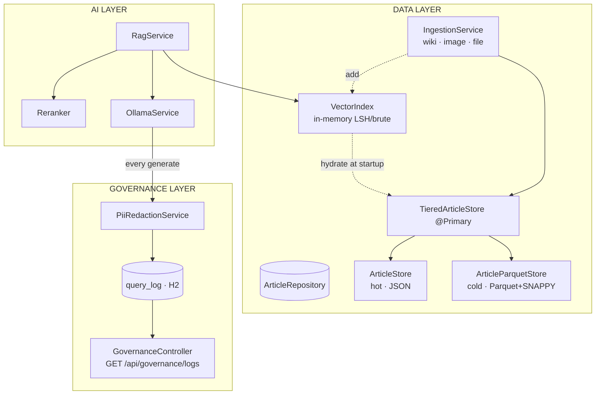
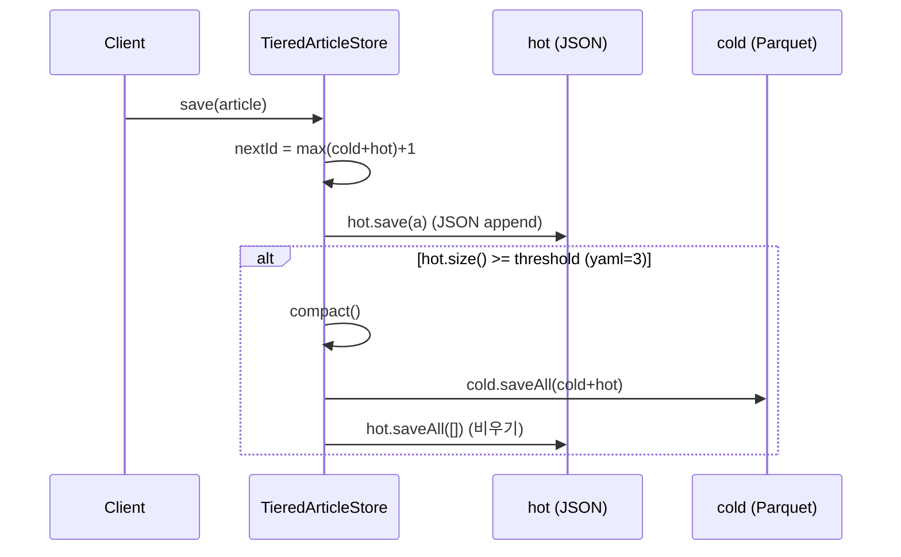
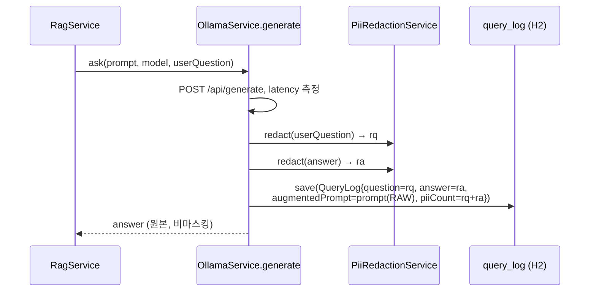

# MiniWatson — Data Layer & Governance Layer 심층 분석

실제 소스 코드(`src/main/java/com/miniwatson/**`) 기준 분석. 기존 `docs/ARCHITECTURE.md`,
`docs/GOVERNANCE.md`, `docs/DATA-MODEL.md`는 일부 **코드와 어긋나 있어**(아래 4 갭 참조)
이 문서가 현 시점의 ground-truth다.

---

## 1. 한눈에 보기



핵심 한 줄: **거버넌스 로깅은 `RagService`가 아니라 `OllamaService.generate()` 안에서
일어난다.** LLM을 때리는 모든 경로(RAG ask · 이미지 캡션 · 파일 요약)가 자동으로
`query_log`에 남는다. 이건 장점(빠짐없는 감사)이자 함정(4.1).

---

## 2. Data Layer

### 2.1 구성요소

| 클래스 | 역할 | 비고 |
|---|---|---|
| `Article` | 도메인 모델 | `namespace`(멀티테넌트 키), `embedding`은 `@JsonProperty(WRITE_ONLY)` |
| `ArticleRepository` | 영속성 인터페이스 | `loadAll/save/saveAll/deleteById` |
| `TieredArticleStore` | **`@Primary` 구현** | hot+cold 2단 티어 오케스트레이션 |
| `ArticleStore` | hot tier | `./data/articles.json`, append-friendly |
| `ArticleParquetStore` | cold tier | `./data/articles.parquet`, 컬럼너+SNAPPY |
| `VectorIndex` | 검색 인덱스 | 인메모리, namespace별, LSH(기본)+exact fallback |
| `IngestionService` | 적재 파이프라인 | wiki REST / 이미지(OCR+Vision) / 파일(Tika+청킹) |

### 2.2 티어드 스토리지 메커니즘



- **읽기**는 항상 `cold ++ hot` 병합(`loadAll`).
- **쓰기**는 hot(JSON)에만 append → 임계치(`storage.tier.threshold`: dev=3 데모용 / prod=500 / 코드 기본 100)에서 cold로 compact.
- 의도: 잦은 소량 ingest는 가벼운 JSON append로, 누적분만 가끔 Parquet 풀-리라이트.

### 2.3 검색 경로 (Retrieval)

```
question
 → embed("search_query: " + question)          (nomic task prefix, 필수)
 → VectorIndex.search(ns, q, FETCH_N=20)        (LSH 후보 → exact fallback)
 → Reranker.rerank(question, candidates, TOP_K=2)
 → context 조립(소스당 600자) → OllamaService.ask(prompt, model, question)
```

- `VectorIndex`는 기동 시 `@PostConstruct hydrate()`로 store에서 적재되고, ingest마다 `add()`로
  증분 갱신. **검색의 in-memory source of truth**(Parquet 재읽기 없음).
- LSH: 16개 랜덤 초평면 부호로 H-bit 시그니처 → 같은 버킷만 exact 채점. 후보 < topK면
  전수 스캔으로 자동 폴백. (소규모 코퍼스에선 `vector.index.lsh.enabled=false` 권장 — DATA-MODEL.md 10.4)

---

## 3. Governance Layer

### 3.1 구성요소

| 클래스 | 역할 |
|---|---|
| `QueryLog` (`@Entity`, `query_log`) | 감사 레코드: question·answer·model·latencyMs·piiCount·augmentedPrompt·createdAt |
| `QueryLogRepository` | `JpaRepository<QueryLog, Long>` (CRUD 자동) |
| `PiiRedactionService` | 정규식 마스킹: `[CARD] [SSN] [EMAIL] [PHONE]`, 마스킹 건수 반환 |
| `GovernanceController` | `GET /api/governance/logs` (전체 반환) |

### 3.2 실제 write path (코드 기준)



원칙: **사용자 응답은 원본 / 저장 로그만 마스킹.** `piiCount`로 거버넌스가 실제 PII를
잡았음을 가시화.

---

## 4. 갭 분석 (문서 vs 코드, 그리고 실 결함)

> 의도적 단순화가 아니라 **실제로 손봐야 할 항목**들. 우선순위 순.

### 4.1 [High] `augmentedPrompt`가 마스킹 없이 저장된다 (PII 누수)
`OllamaService.generate()`는 `question`·`answer`는 redact하지만
`log.setAugmentedPrompt(prompt)`로 **원본 프롬프트를 그대로** 저장한다. 프롬프트엔 사용자
질문(=PII 가능)이 포함되므로, 마스킹된 `question` 옆 칸에 PII가 평문으로 남는다.
→ 5.1에서 수정.

### 4.2 [High] 감사 쓰기 실패가 사용자 요청을 깨뜨린다 (실패 격리 없음)
`GOVERNANCE.md 4`는 "audit write 실패가 user request를 실패시키면 안 됨, try/catch"라고
명시하지만, 실제 `queryLogRepository.save(log)`엔 예외 처리가 없다. H2/DB 장애 시 LLM 응답이
다 끝났는데도 사용자에게 500이 나간다. → 5.2.

### 4.3 [Med] 로깅이 RAG/비-RAG를 구분 못 한다 (의미 혼선)
로깅이 `OllamaService`에 있어서 RAG ask뿐 아니라 **이미지 캡션·파일 요약**까지 같은
`query_log`에 섞인다. 요약 호출의 `question`은 `"summarize: <파일명>"`. 감사 대시보드에서
"사용자 질문"과 "내부 LLM 호출"이 분간되지 않는다. → 5.3 (`source`/`endpoint` 필드 추가).

### 4.4 [Med] 핵심 거버넌스 필드 누락
`GOVERNANCE.md` 스키마엔 `userId · endpoint · sourceCount`가 있으나 실제 `QueryLog`엔 없다.
"누가(주체)·어느 경로·어떤 출처로" 답했는지가 빠져 있어 provenance/lineage가 불완전.

### 4.5 [Low] Read API가 문서보다 빈약
문서는 `?endpoint=`, `?model=` 필터와 `/{id}` 조회를 약속하지만 실제는
`GET /api/governance/logs` 전체 반환 1개뿐. 페이지네이션도 없음(로그 누적 시 위험).

### 4.6 [Low] 동시성/스레드 안전성 없음 (Data)
`TieredArticleStore.save`와 `ArticleStore.save`는 `loadAll → 수정 → saveAll` 비원자적
시퀀스. 동시 ingest 시 lost update·id 중복·JSON 손상 가능. 데모 단일 스레드 가정.

### 4.7 [Low] 우→소 결합: 프레젠테이션 annotation이 영속성에 누수 (Data)
`Article`이 (1) 스토리지 모델 (2) API 응답 DTO를 겸해, `@JsonProperty(WRITE_ONLY)`가
hot JSON 직렬화를 깬 이력(DATA-MODEL.md 10.1, mixin으로 우회). 근본 해결은 DTO 분리.

---

## 5. 코드 설계 제안

### 5.1 augmentedPrompt도 마스킹 (4.1)
```java
// OllamaService.generate()
PiiRedactionService.Redaction rq = piiRedactionService.redact(userQuestion);
PiiRedactionService.Redaction ra = piiRedactionService.redact(answer);
PiiRedactionService.Redaction rp = piiRedactionService.redact(prompt);   // 추가

QueryLog log = new QueryLog();
log.setAugmentedPrompt(rp.text());                       // 마스킹본 저장
log.setQuestion(rq.text());
log.setAnswer(ra.text());
log.setPiiCount(rq.count() + ra.count() + rp.count());   // 합산
```
> 더 나아가면: context(검색 소스)는 KB 원문이라 PII가 많을 수 있으니 prompt 전체 저장 대신
> "마스킹된 프롬프트" + "소스 id 목록"만 남기는 것도 방법.

### 5.2 감사 쓰기 실패 격리 (4.2)
```java
try {
    queryLogRepository.save(log);
} catch (Exception e) {
    // 감사 실패가 사용자 응답을 깨선 안 된다
    org.slf4j.LoggerFactory.getLogger(OllamaService.class)
        .warn("[governance] audit write failed, continuing: {}", e.getMessage());
}
return answer;
```

### 5.3 호출 출처 구분 + 거버넌스 필드 (4.3 / 4.4)
`QueryLog`에 필드 추가:
```java
private String source;       // "rag" | "summarize" | "vision" | "raw"
private String endpoint;     // "/api/rag/ask" 등
private Integer sourceCount; // RAG 검색 소스 개수
private String userId;       // 인증 도입 전 "anonymous"
```
`generate(...)` 시그니처에 `source`/`endpoint`/`sourceCount`를 받도록 확장하거나,
간단히는 별도 `record AuditContext(...)`를 넘긴다. 호출부(RagService·DataController)에서 설정.

### 5.4 Read API 보강 (4.5)
```java
@GetMapping("/logs")
public Page<QueryLog> logs(
    @RequestParam(required = false) String model,
    @RequestParam(required = false) String source,
    Pageable pageable) {            // ?page=0&size=50&sort=createdAt,desc
    // Spring Data: 파생 쿼리 or Specification
}
@GetMapping("/logs/{id}")
public QueryLog one(@PathVariable Long id) { ... }
```
`QueryLogRepository extends JpaRepository<QueryLog,Long>, JpaSpecificationExecutor<QueryLog>`로
필터 조합을 지원.

### 5.5 (선택) 스토리지 모델 ↔ API DTO 분리 (4.6/4.7 구조 개선)
`Article`(스토리지) ↔ `ArticleResponse`(API)로 분리하면 WRITE_ONLY mixin 우회가 불필요해지고,
영속성 경로가 프레젠테이션 annotation에 휘둘리지 않는다. 동시성은 store 단위 `synchronized`
또는 단일 라이터 큐로 1차 방어 후, 운영 전환 시 Iceberg/Delta로.

---

## 6. 권장 적용 순서

1. **5.1 + 5.2** — 두 줄~몇 줄로 PII 누수와 가용성 결함을 즉시 제거 (최고 ROI).
2. **5.3** — `source` 한 필드만 먼저 추가해 RAG/내부 호출 분리.
3. **5.4** — 페이지네이션(로그 폭증 대비) → 필터.
4. **5.5** — 리팩터링성 개선, 여유 있을 때.

각 항목은 기존 `docs/GOVERNANCE.md 8`(미구현 목록)과도 정합. 적용하면 그 표의
"실패 격리", "right-to-be-forgotten"(5.4의 DELETE 확장) 항목을 점진 해소한다.
